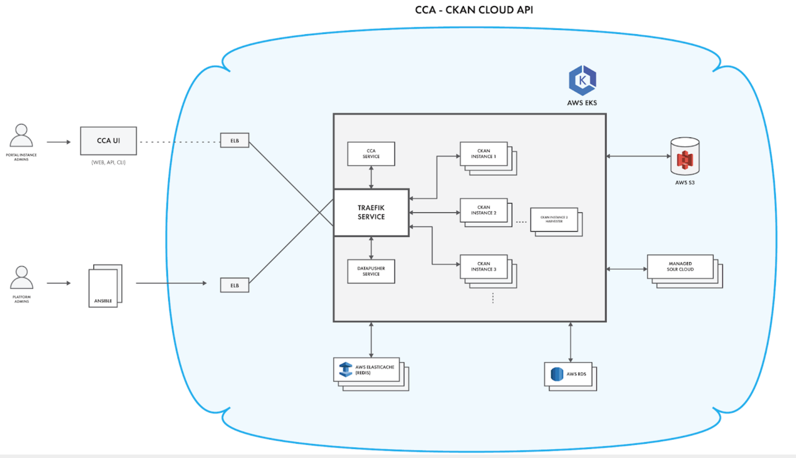

# datagov-ckan-multi

The Data.gov multi-tenant CKAN platform

## Components

### Ansible

All operations to create multi-tenant platform environments, as well as managing and maintaining existing ones shall be performed using Ansible. The Ansible roles and configuration will manage AWS services provisioning and scaling:

* AWS ELB - Load balancers to the Kubernetes internal load balancer (Traefik)
* AWS EKS - Managed Kubernetes service enabling deployment of CKAN Instances and associated services (e.g. CKAN Harvest).
* AWS S3 - Used to store assets used on CKAN Instances such as Group logo images, CKAN Site images, etc. Optionally, it can also be enabled to be used as a CKAN filestore, if any portal requires the CKAN FileStore component.
* AWS Elasticache - Managed redis cluster providing the redis service required for CKAN versions 2.7 and above.
* AWS RDS - Managed PostgreSQL service providing database backend for CKAN and CKAN DataStore instances

### Kubernetes
* Traefik - Internal cluster load balancer with Letsencrypt automated SSL certificates support
* CCA - CKAN Cloud API providing the necessary functionalities to create, manage and delete CKAN Instances. The following CCA features enable fully automated CKAN Instance management:
  * CKAN versions support - Manage CKAN dependencies (SOLR schema, database schema, etc.) for specific versions
  * CKAN SOLR schemas - Manage available SOLR schemas available when provisioning CKAN Instances
  * CKAN database operations - Create, update, delete CKAN and CKAN DataStore database objects
  * CKAN SOLR cores/indexes - Create, update, delete SOLR cores/indexes
  * CKAN Instance scaffolding - Generate a fully functional CKAN Instance with all required services and configuration
  * CKAN Instance management - Manage CKAN portal admins, theme options and harvester configuration
  * CCA UI - Web-based and CLI interface for interfacing with the Multi-tenant CKAN Platform
* CKAN DataPusher - Service which loads data from structured dataset resources to the datastore
* SOLRCloud - SOLRCloud is a clustered version of Apache SOLR which is used by CKAN as a search index.

### CKAN Cloud API
The CCA UI functions as the main interface for ‘CKAN Portal Instance Admins’ to the platform. It provides access to all of the features of CCA, given permissions, enabling users to create CKAN Instances and manage existing ones. Users logged-on to the CCA UI shall see a list of instances that they manage and, having the right permissions, would be able to create more instances.

### Docker Containers
 CKAN Instances shall use Docker container technology and by default contain all of the default extensions defined by Data.gov - ‘data.gov base CKAN Instance docker image’. CKAN Instance Admins shall have the ability to enable and configure additional extensions, if Data.gov wishes to allow this.

A white-label theme with support for changing logos and theme colors shall be developed which will be part of Data.gov’s base CKAN Instance docker image. The theme will allow ‘CKAN Portal Instance Admins’ to manage the logo and colors of their CKAN portal. It will also be possible to override the default white-label theme if Data.gov would allow this on the platform. Custom domain names will be supported along with flexible themes to facilitate branding for each instance.

### Authentication/Authorization
To create, manage and delete CKAN Instances within the multi-tenant CKAN platform, a ‘CKAN Portal Instance Admin’ role exists within CCA, which controls who has permissions to create, manage and delete CKAN Instances on the platform. A ‘CKAN multi-tenant platform super-admin’ can create, update and delete permissions for ‘CKAN Portal Instance Admins’. 

The ‘Platform Admin’ role will be able to manage deployed environments to ensure ongoing maintenance of platform components. This role shall be an AWS IAM role. All specific configurations of deployed environments shall be version controlled and managed as code.
